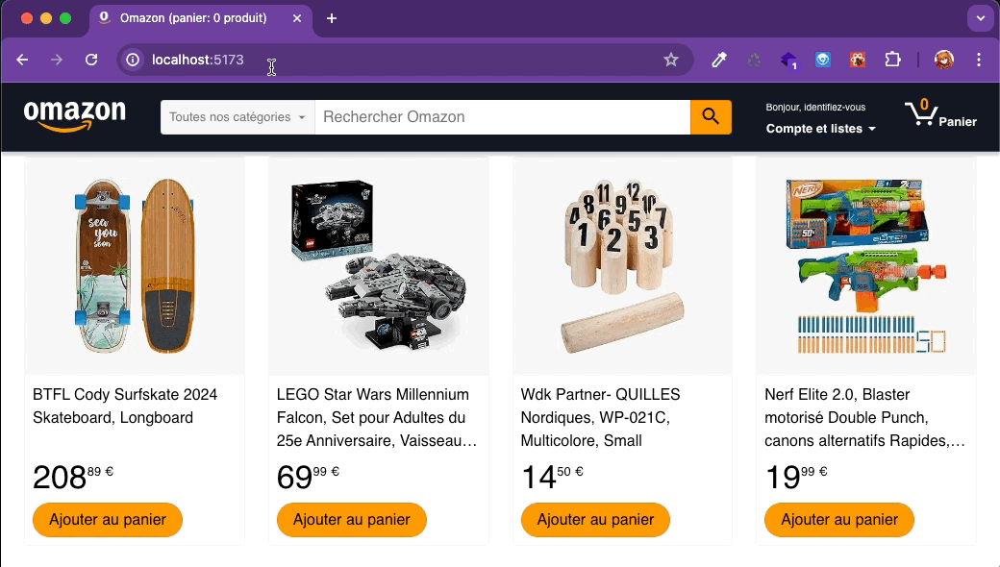
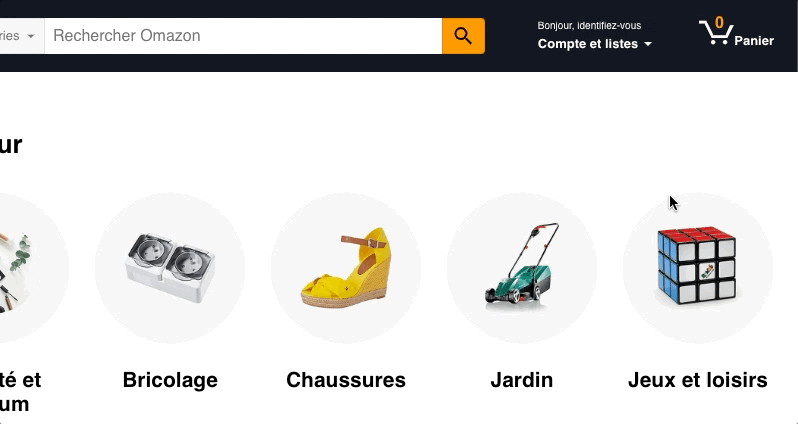

# Challenge 3 : `useEffect` pour gérer nos effets de bord.

## 1. Modification du DOM réél

### 1.1. Ombre portée sur le header au scroll

**Objectif : Ajouter un effet ombré sur le header quand on fait défiler la page.**

Pour pour ajouter un écouteur de scroll sur le DOM réél, on va utiliser un effet.

- dans le scss, ajoute une classe `.header--scroll` qui définit un style avec une ombre portée sous le header.
- ajoute un effet qui se déclanchera après le premier rendu et qui pose un écouteur de scroll sur l'objet window.
- dans le handler de scroll :
  - si on a scrollé vers le bas : ajoute la classe `.header--scroll`
  - si on est en haut de la page : supprime la classe `.header--scroll`

### 1.2. Changement du titre de l'onglet

**Objectif : Afficher un titre qui indique le nombre de produits du panier.**

Pour pour modifier le titre de la page dans le DOM réél, on va utiliser un effet.

- ajoute un effet qui se déclanchera après le premier rendu et à chaque fois que le nombre de produits dans le panier change
- dans cet effet, modifie le titre du document pour afficher `Omazon - (panier : X produits)`

## 2. API

**Objectif : afficher les catégories et produits de la base de données mis à dispo par l'API back.**

> Voici le repo de l'API : **[repo omazon-server](https://github.com/O-clock-Mimir/S16-react-omazon-server)**  (si tu veux regarder le code) 
> Il est également hébergé sur OnRender ici : **[https://omazon-server.onrender.com/](https://omazon-server.onrender.com/)**

Une fois que tu auras récupéré les données de l'API, tu voudras les utiliser pour l'affichage, donc tu dois les placer dans un state !

### 2.1. Les produits

- normalement tu as déjà un emplacement de state pour stocker les produits ;
  
- initialise le avec un tableau vide au lieu de la liste importée du fichier de données
  > _Mais pense à préciser que ce tableau stockera des objets de type Product avec le type générique de useState._

- dans un effet exécuté après le premier rendu, fais l'appel ajax pour récuperer les produits

- dès que tu reçois les produits, stocke-les dans le state, ils s'affichent !

### 2.2. Les categories

- crée un emplacement de state pour stocker les catégories
- initialise-le avec un tableau vide car au debut tu n'as pas la réponse de l'API
- diffuse ce tableau via les props à tous les composants qui ont besoin des catégories (la liste de selection du menu, la home page, la liste de selection du formulaire d'ajout de produit)
- dans un effet exécuté après le premier rendu, fais l'appel ajax pour récuperer les produits
- dès que tu reçois les produits, stocke-les dans le state, ils s'affichent !

### 2.3. Les tags

Pour les tags, tu n'as pas besoin de les récupérer directement : on ne s'en sert pas tels quels dans le projet.  
Par contre, il serait intéressant de les avoir (détaillés) dans les produits !

_json-server_ permet de gérer les relations entre les tables, essaie d'aller sur https://omazon-server.onrender.com/products?_expand=tag.

Dans ton code, tu dois donc modifier le _endpoint_ utilisé à l'étape 2.1.

> Tu auras peut-être du JSX et du SCSS à faire/corriger…

## 3. Formulaire de login

**Objectif : mettre en place le formulaire de login au clic sur le lien "identifiez-vous" et donner le focus au champ E-mail.**

### 3.1. Affichage conditionnel du composant LoginForm

- crée un composant `<LoginForm />` en t'aidant de la maquette figma
- ce composant est affiché quand l'utilisateur clique sur le lien "identifiez-vous" → affichage conditonnel en fonction d'un état

### 3.2. Focus sur l'email

- place une _ref_ sur l'élément input email ([voir la doc React](https://react.dev/reference/react/useRef#manipulating-the-dom-with-a-ref))
- dans un effet exécuté après le premier rendu du composant `<LoginForm />` : place le focus dans l'element input email
